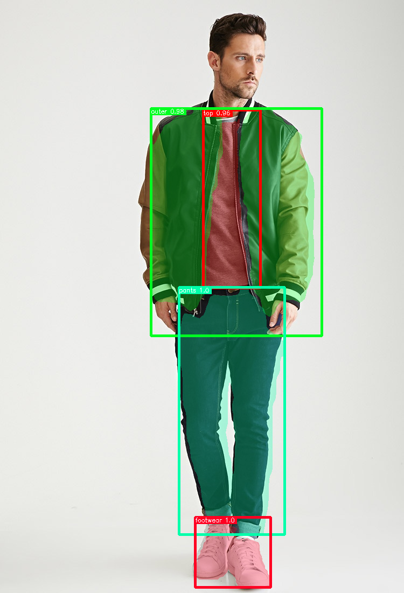

# MMFashion

## Input


(Image from https://github.com/open-mmlab/mmfashion/blob/master/demo/imgs/01_4_full.jpg)

Shape : (1, 3, height, width)  

## Output



- bboxes shape : (objects, bbox)
- labels shape : (objects)
- masks shape : (objects, 28, 28)
- bbox : (left, top, right, bottom, probability)
- probability : [0.0,1.0]

## Category

```
CATEGORY = (
    'top', 'skirt', 'leggings', 'dress', 'outer', 'pants', 'bag',
    'neckwear', 'headwear', 'eyeglass', 'belt', 'footwear', 'hair',
    'skin', 'face'
)
```

### usage
Automatically downloads the onnx and prototxt files on the first run.
It is necessary to be connected to the Internet while downloading.

For the sample image,
``` bash
$ python3 mmfashion.py
```

If you want to specify the input image, put the image path after the `--input` option.  
You can use `--savepath` option to change the name of the output file to save.
```bash
$ python3 mmfashion.py --input IMAGE_PATH --savepath SAVE_IMAGE_PATH
```

By adding the `--video` option, you can input the video.   
If you pass `0` as an argument to VIDEO_PATH, you can use the webcam input instead of the video file.
```bash
$ python3 mmfashion.py --video VIDEO_PATH
```

## Reference

- [MMDetection](https://github.com/open-mmlab/mmdetection)
- [MMFashion](https://github.com/open-mmlab/mmfashion)
- [OTEDetection](https://github.com/openvinotoolkit/mmdetection)

## Framework

ONNX Runtime

## Model Format

ONNX opset=10

## Netron

[mask_rcnn_r50_fpn_1x.onnx.prototxt](https://lutzroeder.github.io/netron/?url=https://storage.googleapis.com/ailia-models/mmfashion/mask_rcnn_r50_fpn_1x.onnx.prototxt)
