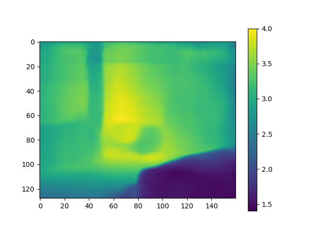

# FCRN-DepthPrediction

## Input


Shape : (1, 228, 304, 3)  

## Output



Shape : (128, 160, 1)  

### usage
Automatically downloads the onnx and prototxt files on the first run.
It is necessary to be connected to the Internet while downloading.

For the sample image,
``` bash
$ python3 fcrn-depthprediction.py
```

If you want to specify the input image, put the image path after the `--input` option.  
You can use `--savepath` option to change the name of the output file to save.
```bash
$ python3 fcrn-depthprediction.py --input IMAGE_PATH --savepath SAVE_IMAGE_PATH
```

By adding the `--video` option, you can input the video.   
If you pass `0` as an argument to VIDEO_PATH, you can use the webcam input instead of the video file.
```bash
$ python3 fcrn-depthprediction.py --video VIDEO_PATH
```

## Reference

[Deeper Depth Prediction with Fully Convolutional Residual Networks](https://github.com/iro-cp/FCRN-DepthPrediction)

## Framework

Tensorflow

## Model Format

ONNX opset=11

## Netron

[midas.onnx.prototxt](https://netron.app/?url=https://storage.googleapis.com/ailia-models/midas/midas.onnx.prototxt)
