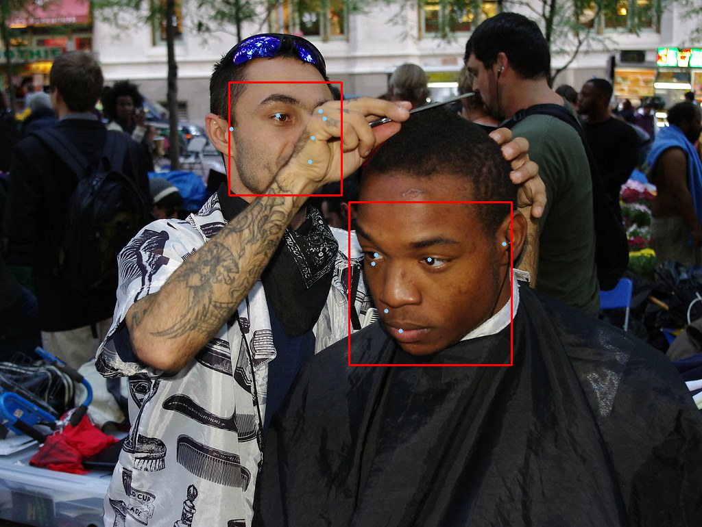

# BlazeFace

### input


(Image from https://github.com/hollance/BlazeFace-PyTorch/blob/master/3faces.png)

Ailia input shape: (1, 3, 128, 128)  
Range: [-1, 1]

### output


### usage
Automatically downloads the onnx and prototxt files on the first run.
It is necessary to be connected to the Internet while downloading.

For the sample image,
``` bash
$ python3 blazeface.py 
```

If you want to specify the input image, put the image path after the `--input` option.  
You can use `--savepath` option to change the name of the output file to save.
```bash
$ python3 blazeface.py --input IMAGE_PATH --savepath SAVE_IMAGE_PATH
```

By adding the `--video` option, you can input the video.   
If you pass `0` as an argument to VIDEO_PATH, you can use the webcam input instead of the video file.
```bash
$ python3 blazeface.py --video VIDEO_PATH --savepath SAVE_VIDEO_PATH
```

### Reference

[BlazeFace-PyTorch](https://github.com/hollance/BlazeFace-PyTorch)


### Framework
PyTorch 1.1


### Model Format
ONNX opset = 10


### Netron

[blazeface.onnx.prototxt](https://lutzroeder.github.io/netron/?url=https://storage.googleapis.com/ailia-models/blazeface/blazeface.onnx.prototxt)
