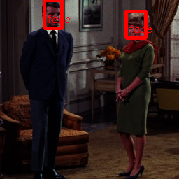

# yolov3-face

## Input


Shape : (1, 3, 416, 416)
Range : [0.0, 1.0]

## Output



- category : [0,0]
- probablity : [0.0,1.0]
- position : x, y, w, h [0,1]

## usage
Automatically downloads the onnx and prototxt files on the first run.
It is necessary to be connected to the Internet while downloading.

For the sample image,
``` bash
$ python3 yolov3-face.py
```

If you want to specify the input image, put the image path after the `--input` option.  
You can use `--savepath` option to change the name of the output file to save.
```bash
$ python3 yolov3-face.py --input IMAGE_PATH --savepath SAVE_IMAGE_PATH
```

By adding the `--video` option, you can input the video.   
If you pass `0` as an argument to VIDEO_PATH, you can use the webcam input instead of the video file.
```bash
$ python3 yolov3-face.py --video VIDEO_PATH
```

## Reference

- [Face detection using keras-yolov3](https://github.com/axinc-ai/yolov3-face)

## Framework

Keras 2.2.4

## Model Format

ONNX opset=10

## Netron

[yolov3-face.opt.onnx.prototxt](https://lutzroeder.github.io/netron/?url=https://storage.googleapis.com/ailia-models/yolov3-face/yolov3-face.opt.onnx.prototxt)
