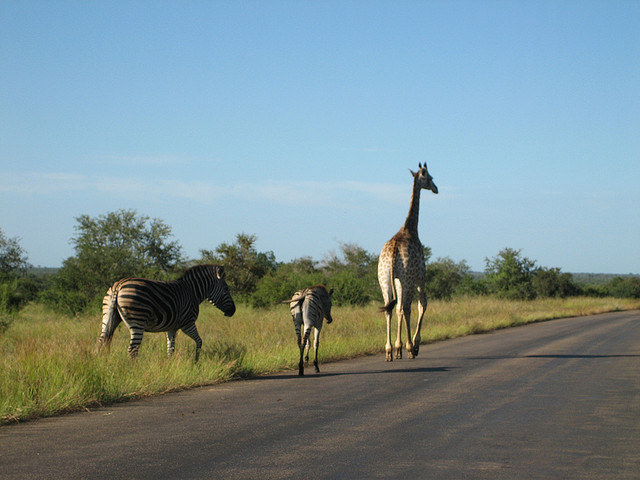

# Image Captioning pytorch

### input



(Image from http://images.cocodataset.org/train2017/000000505539.jpg)

### output
- Estimating Caption
```bash
### Caption ###
 a giraffe and a zebra standing in a field
```

### usage
Automatically downloads the onnx and prototxt files on the first run.
It is necessary to be connected to the Internet while downloading.

For the sample image,
``` bash
$ python3 image_captioning.py
```

If you want to specify the input image, put the image path after the `--input` option.  
```bash
$ python3 image_captioning.py --input IMAGE_PATH
```

By adding the `--video` option, you can input the video.   
If you pass `0` as an argument to VIDEO_PATH, you can use the webcam input instead of the video file.
```bash
$ python3 image_captioning.py --video VIDEO_PATH
```

The default captioning model is fc.   
By adding the `--model fc_rl` option, you can use fc_rl model for captioning.
Or by adding the `--model fc_nsc` option, you can use fc_nsc.

### Reference

- [Image Captioning pytorch](https://github.com/ruotianluo/ImageCaptioning.pytorch)

### Framework

ONNX Runtime

### Model Format

ONNX opset = 11

### Netron

- [model_feat.onnx.prototxt](https://netron.app/?url=https://storage.googleapis.com/ailia-models/image_captioning_pytorch/model_feat.onnx.prototxt)
- [model_caption.onnx.prototxt](https://netron.app/?url=https://storage.googleapis.com/ailia-models/image_captioning_pytorch/model_caption.onnx.prototxt)
