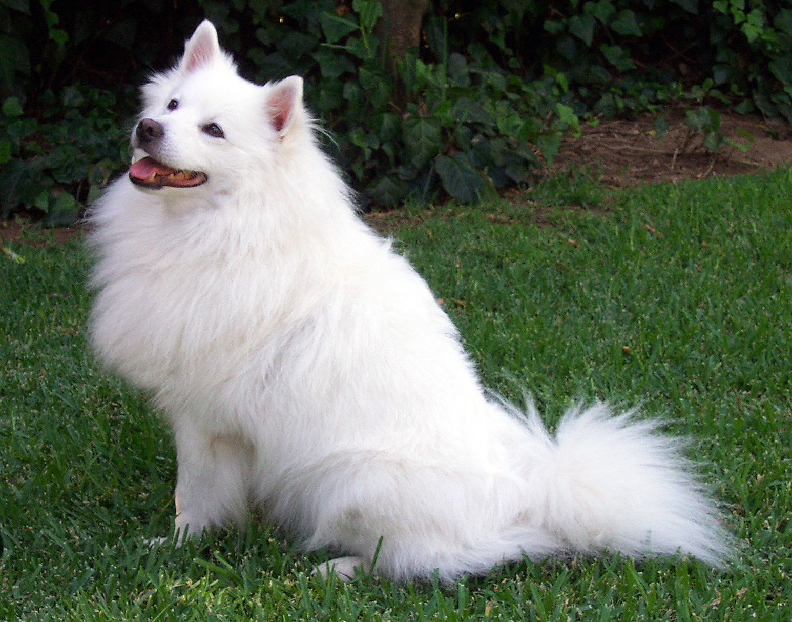

# Imagenet21K

## Input



Ailia input shape: (1,3,299,299)
Range: [0.0, 255.0]

## Output
```
class_count=8
+ idx=0
  category=6[artifact ]
  prob=83.32571411132812
+ idx=1
  category=3682[device ]
  prob=81.23466491699219
+ idx=2
  category=3375[clock ]
  prob=79.72785186767578
+ idx=3
  category=6598[timepiece ]
  prob=69.04891967773438
+ idx=4
  category=4591[instrument ]
  prob=63.67098617553711
+ idx=5
  category=4957[measuring_instrument ]
  prob=63.452571868896484
+ idx=6
  category=2462[alarm_clock ]
  prob=54.95254898071289
+ idx=7
  category=4306[grandfather_clock ]
  prob=37.9827995300293

```

## Usage
Automatically downloads the onnx and prototxt files on the first run.
It is necessary to be connected to the Internet while downloading.

For the sample image,
``` bash
$ python3 imagenet21k.py
```

If you want to specify the input image, put the image path after the `--input` option.  
```bash
$ python3 imagenet21k.py --input IMAGE_PATH
```

By adding the `--video` option, you can input the video.   
If you pass `0` as an argument to VIDEO_PATH, you can use the webcam input instead of the video file.
```bash
$ python3 imagenet21k.py --video VIDEO_PATH
```

You can select a pretrained model by specifying -a mixer, resnet50 ,mobilenet or vit(default).

## Reference

[ImageNet21K](https://github.com/Alibaba-MIIL/ImageNet21K)

## Model Format

ONNX opset = 14

## Framework

pytorch

## Netron

[mobilenetv3_large_100.onnx.prototxt](https://netron.app/?url=https://storage.googleapis.com/ailia-models/imagenet21k/mobilenetv3_large_100.onnx.prototxt)

[mixer_b16_224_miil_in21k.onnx.prototxt](https://netron.app/?url=https://storage.googleapis.com/ailia-models/imagenet21k/mixer_b16_224_miil_in21k.onnx.prototxt)

[resnet50.onnx.prototxt](https://netron.app/?url=https://storage.googleapis.com/ailia-models/imagenet21k/resnet50.onnx.prototxt)

[vit_base_patch16_224_miil_in21k](https://netron.app/?url=https://storage.googleapis.com/ailia-models/imagenet21k/vit_base_patch16_224_miil_in21k)
