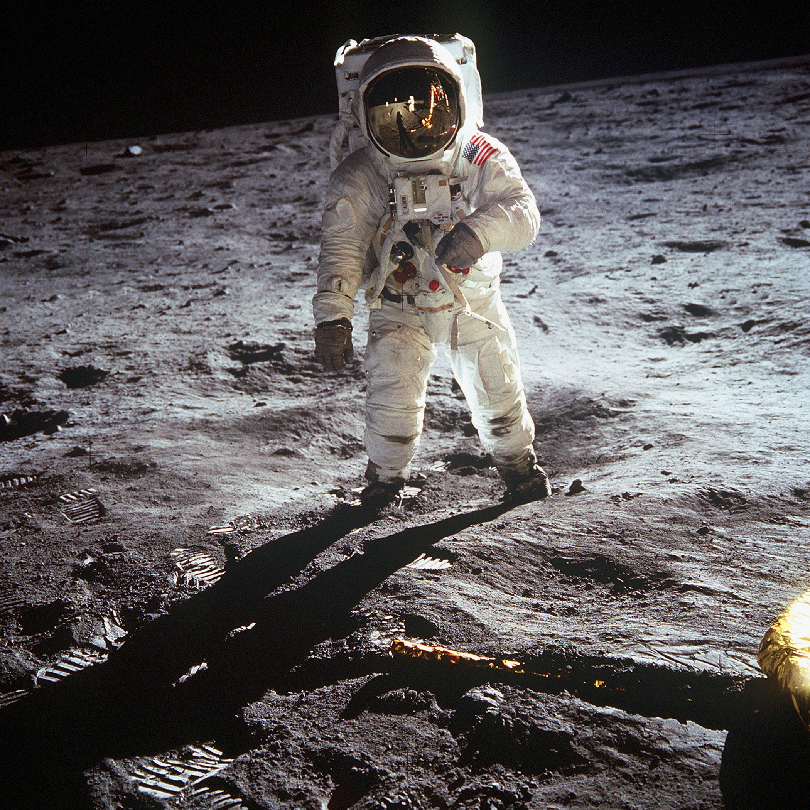

# 3D Photography using Context-aware Layered Depth Inpainting

## Input



(Image from https://github.com/vt-vl-lab/3d-photo-inpainting/blob/master/image/moon.jpg)

## Output


## Requirements
This model requires additional module.

```
pip3 install vispy==0.6.4
pip3 install moviepy==1.0.2
pip3 install transforms3d==0.3.1
pip3 install networkx==2.3
pip3 install cynetworkx
```

If you using macOS bigsur, you must replace

```
appkit = cdll.LoadLibrary(util.find_library('AppKit')) #vispy/ext/cocoapy.py
_fname = ctypes.util.find_library('OpenGL') #vispy/gloo/gl/gl2.py
```

with

```
appkit = cdll.LoadLibrary('/System/Library/Frameworks/AppKit.framework/Versions/Current/AppKit') #vispy/ext/cocoapy.py
_fname = '/System/Library/Frameworks/OpenGL.framework/OpenGL' #vispy/gloo/gl/gl2.py
```

https://github.com/vispy/vispy/issues/1885

## Usage
Automatically downloads the onnx and prototxt files on the first run.
It is necessary to be connected to the Internet while downloading.

For the sample image,
``` bash
$ python3 3d-photo-inpainting.py
```

The results are stored in the following directories:
- Corresponding depth map estimated by MiDaS (Can be changed with `--savepath` option)
  - E.g. output.png
- Inpainted 3D mesh (Optional: User need to switch on the flag save_ply)
  - E.g. output.ply
- Rendered videos with zoom-in motion
  - E.g. video/moon_zoom-in.mp4
- Rendered videos with swing motion
  - E.g. video/moon_swing.mp4
- Rendered videos with circle motion
  - E.g. video/moon_circle.mp4
- Rendered videos with dolly zoom-in effect
  - E.g. video/moon_dolly-zoom-in.mp4

Note: We assume that the object of focus is located at the center of the image.

If you want to specify the input image, put the image path after the `--input` option.  
You can use `--savepath` option to change the name of the output file to save.
```bash
$ python3 3d-photo-inpainting.py --input IMAGE_PATH --savepath SAVE_IMAGE_PATH
```

By adding the `--video` option, you can input the video.   
If you pass `0` as an argument to VIDEO_PATH, you can use the webcam input instead of the video file.
```bash
$ python3 3d-photo-inpainting.py --video VIDEO_PATH
```

If you want to change the video generation configuration.  
Please read [DOCUMENTATION.md](https://github.com/vt-vl-lab/3d-photo-inpainting/blob/master/DOCUMENTATION.md) and modified argument.yml.

## Reference

- [3D Photography using Context-aware Layered Depth Inpainting](https://github.com/vt-vl-lab/3d-photo-inpainting)

## Framework

Pytorch

## Model Format

ONNX opset=11

## Netron

[MiDaS_model.onnx.prototxt](https://netron.app/?url=https://storage.googleapis.com/ailia-models/3d-photo-inpainting/MiDaS_model.onnx.prototxt)
[edge-model.onnx.prototxt](https://netron.app/?url=https://storage.googleapis.com/ailia-models/3d-photo-inpainting/edge-model.onnx.prototxt)
[depth-model.onnx.prototxt](https://netron.app/?url=https://storage.googleapis.com/ailia-models/3d-photo-inpainting/depth-model.onnx.prototxt)
[color-model.onnx.prototxt](https://netron.app/?url=https://storage.googleapis.com/ailia-models/3d-photo-inpainting/color-model.onnx.prototxt)
