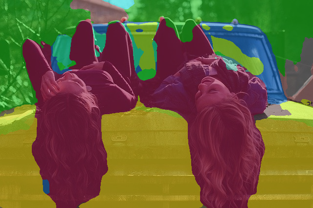

# dense_prediction_transformers

### Input
image file (384x576)


(Image from https://pixabay.com/ja/photos/%E5%A5%B3%E3%81%AE%E5%AD%90-%E5%98%98-%E3%82%AF%E3%83%A9%E3%82%B7%E3%83%83%E3%82%AF%E3%82%AB%E3%83%BC-1209321/)

### Output

image file (384x576)

--task=monodepth_outputs


--task=segmentation



### Usage

Automatically downloads the onnx and prototxt files on the first run. It is necessary to be connected to the Internet while downloading.

If you run by onnxruntime instead of ailia, you use `--onnx` option.

This sample has monodepth and segmentation task. You have to add `--task=monodepth` in the case of running monodepth task and `--task=segmentation` in the case of running segmentation task.

Below is example of running segmentation task by cpu.

```bash
$ python3 dense_prediction_transformers.py --task=monodepth -e 0
$ python3 dense_prediction_transformers.py --task=segmentation -e 0
```

After running this program, predicted images are saved in monodepth_outputs or segmentation_outputs directory.

### Reference

[dense_prediction_transformers](https://github.com/intel-isl/DPT)  

### Framework

PyTorch 1.8.1

### Model Format

ONNX opset = 11

### Netron

[dpt_hybrid_monodepth.onnx.prototxt](https://netron.app/?url=https://storage.googleapis.com/ailia-models/dpt_hybrid_monodepth.onnx)    
[dpt_hybrid_segmentation.onnx.prototxt](https://netron.app/?url=https://storage.googleapis.com/ailia-models/dpt_hybrid_segmentation.onnx)
