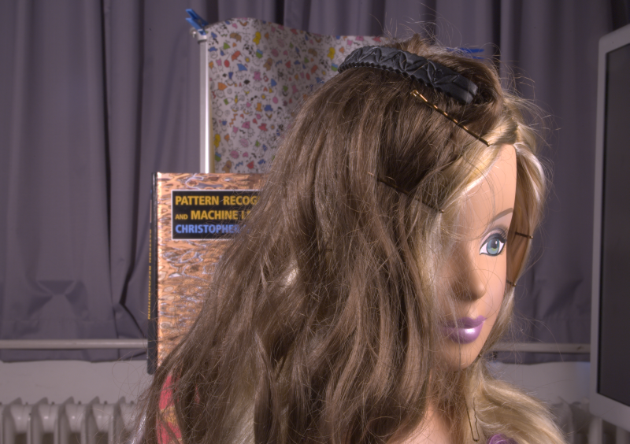
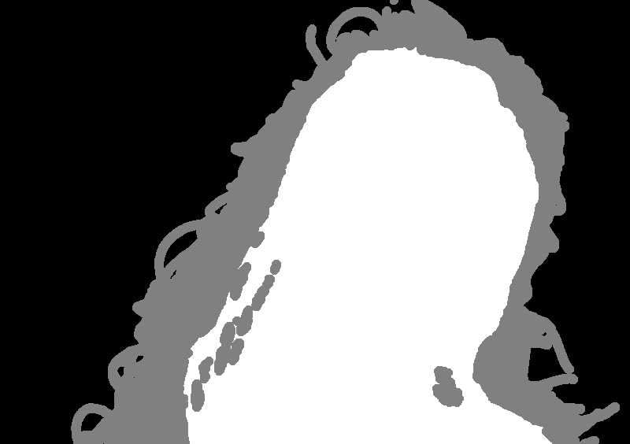

# Deep Image Matting

### input

input image


input trimap


(from https://github.com/foamliu/Deep-Image-Matting-PyTorch/tree/master/data/alphamatting/input_lowres)

Ailia input shape: (1, 320, 320, 4) input range: (0,1)  

### output


### usage
Automatically downloads the onnx and prototxt files on the first run.
It is necessary to be connected to the Internet while downloading.

For the sample image,
``` bash
$ python3 deep-image-matting.py
```

If you want to specify the input image, put the image path after the `--input` and `--trimap` option.  
You can use `--savepath` option to change the name of the output file to save.
```bash
$ python3 deep-image-matting.py --input IMAGE_PATH --trimap TRIMAP_PATH --savepath SAVE_IMAGE_PATH
```

By adding the `--video` option, you can input the video.   
If you pass `0` as an argument to VIDEO_PATH, you can use the webcam input instead of the video file. The trimap is generated by DeeplabV3.
```bash
$ python3 deep-image-matting.py --video VIDEO_PATH
```

### Reference

[Deep Image Matting](https://github.com/foamliu/Deep-Image-Matting)


### Framework
Keras 2.3.1


### Model Format
ONNX opset = 10


### Netron
[deep-image-matting.onnx.prototxt](https://lutzroeder.github.io/netron/?url=https://storage.googleapis.com/ailia-models/deep-image-matting/deep-image-matting.onnx.prototxt)
