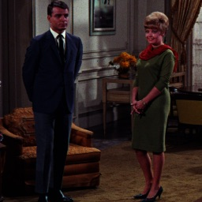
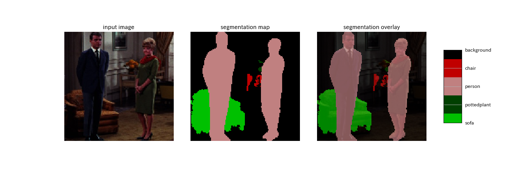

# deeplabv3

## Input



Ailia input shape: (1, 3, 513, 513)
Range: [-1.0, 1.0]

## Output




## Usage
Automatically downloads the onnx and prototxt files on the first run. It is necessary to be connected to the Internet while downloading.

For the sample image,
```bash
python3 deeplabv3.py 
```

If you want to specify the input image, put the image path after the `--input` option.
You can use `--savepath` option to change the name of the output file to save.
```bash
$ python3 deeplabv3.py --input IMAGE_PATH --savepath SAVE_IMAGE_PATH
```

By adding the `--video` option, you can input the video.
If you pass `0` as an argument to VIDEO_PATH, you can use the webcam input instead of the video file.
```bash
$ python3 deeplabv3.py --video VIDEO_PATH --savepath SAVE_VIDEO_PATH
```

The default setting is to use the optimized model and weights, but you can also switch to the normal model by using the `--normal` option.

## Category

VOC

## Reference

[Xception65 for backbone network of DeepLab v3+](https://github.com/tensorflow/models/tree/master/research/deeplab)

## Model Format

ONNX opset = 10

## Framework

Chainer 6.3.0

## Netron

[deeplabv3.onnx.prototxt](https://lutzroeder.github.io/netron/?url=https://storage.googleapis.com/ailia-models/deeplabv3/deeplabv3.onnx.prototxt)

[deeplabv3.opt.onnx.prototxt](https://lutzroeder.github.io/netron/?url=https://storage.googleapis.com/ailia-models/deeplabv3/deeplabv3.opt.onnx.prototxt)

