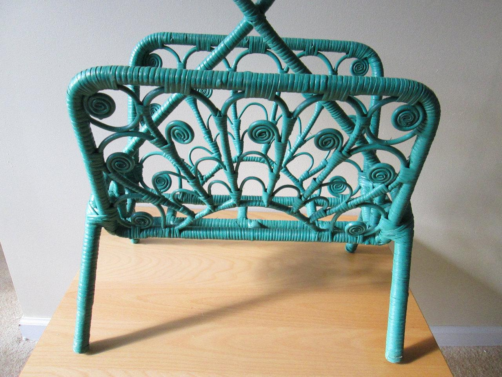

# DIS segmentation

### Input



(from https://github.com/xuebinqin/DIS)

Ailia input shape(1, 3, Y, X)   where X and Y are multiples of 64
Range:[0, 1]

### Output


### Usage
Automatically downloads the onnx and prototxt files on the first run. It is necessary to be connected to the Internet while downloading.

For the sample image,
```
$ python3 dis_seg.py
```

If you want to specify the input image, put the image path after the `--input` option.
You can use `--savepath` option to change the name of the output file to save.
```
$ python3 dis_seg.py --input IMAGE_PATH --savepath SAVE_IMAGE_PATH
```

By adding the `--video` option, you can input the video.
If you pass `0` as an argument to VIDEO_PATH, you can use the webcam input instead of the video file.
```
$ python3 dis_seg.py --video VIDEO_PATH
```

The default setting is to use the optimized model and weights, but you can also switch to the normal model by using the `--normal` option.

### Reference

[DIS (github)](https://github.com/xuebinqin/DIS)

### Framework
PyTorch

### Model Format
ONNX opset = 12

### Netron

[dis.onnx.prototxt](https://netron.app/?url=https://storage.googleapis.com/ailia-models/dis/dis.onnx.prototxt)
