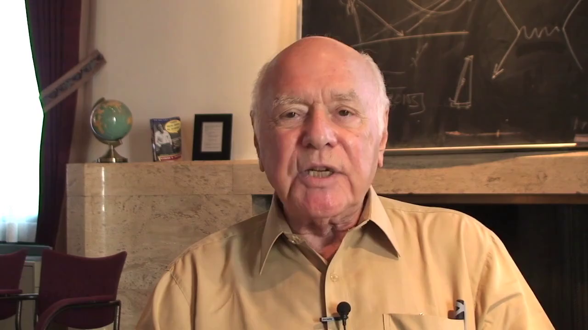

# Semantic segmentation with MobileNetV3

## Input



(Video from https://github.com/NikolasEnt/PersonMask_TFLite/blob/master/data/test.mp4)

Shape : (N, 224, 224, 3)

## Output


Shape : (N, 224, 224, 1)

## Usage
Automatically downloads the onnx and prototxt files on the first run.
It is necessary to be connected to the Internet while downloading.

For the sample image,
``` bash
$ python3 sem_seg.py
```

If you want to specify the input image, put the image path after the `--input` option.  
You can use `--savepath` option to change the name of the output file to save.
```bash
$ python3 sem_seg.py --input IMAGE_PATH --savepath SAVE_IMAGE_PATH
```

By adding the `--video` option, you can input the video.   
If you pass `0` as an argument to VIDEO_PATH, you can use the webcam input instead of the video file.
```bash
$ python3 sem_seg.py --video VIDEO_PATH
```

## Reference

- [Semantic segmentation with MobileNetV3](https://github.com/OniroAI/Semantic-segmentation-with-MobileNetV3)
- [Person Segmentation](https://github.com/NikolasEnt/PersonMask_TFLite)

## Framework

TensorFlow

## Model Format

ONNX opset=10

## Netron

[sem_seg.onnx.prototxt](https://netron.app/?url=https://storage.googleapis.com/ailia-models/semantic-segmentation-mobilenet-v3/sem_seg.onnx.prototxt)
