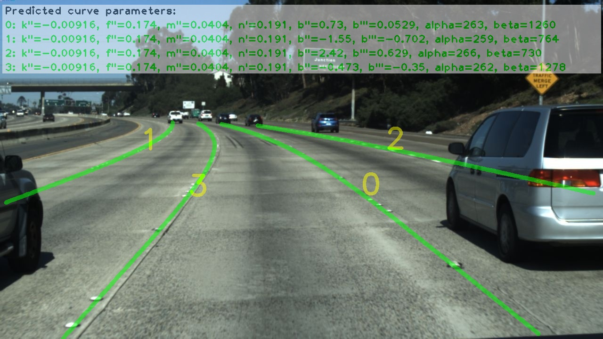

# LSTR: Lane Shape Prediction with Transformers

### Input
Images with the same aspect ratio as 360×640. This model detect lane from inputs.
- input image    
    

### Output
Images which the detected lane in input images is colored in green.
- output image    
Four green lines mean each detected lane which model predicted and numbers attached to each line mean line number.    
Predicted curve parameters are showed at the top of the image.


### Usage
You have to specify input filetype and input filepath.    
- Image mode (image to image)   
You run sample script as below if your desired file path is {Path to LSTR}/input/image/1.jpg.
```bash
$ python3 lstr.py --ftype image --input ./input/image/1.jpg
```

- Video mode (video to video)   
You run sample script as below if your desired file path is {Path to LSTR}/input/video/video1.mp4.
```bash
$ python3 lstr.py --ftype video --video ./input/video/video1.mp4
```


## Reference
- Repository    
[LSTR](https://github.com/liuruijin17/LSTR)

- Input images and videos    
Input images are part of [TuSimple](https://github.com/TuSimple/tusimple-benchmark) dataset and input videos are created by using TuSimple images.

## Framework

PyTorch 1.8.0


## Model Format

ONNX opset = 11

## Netron

[lstr.onnx.prototxt](https://netron.app/?url=https://storage.googleapis.com/ailia-models/lstr/lstr.onnx.prototxt)
