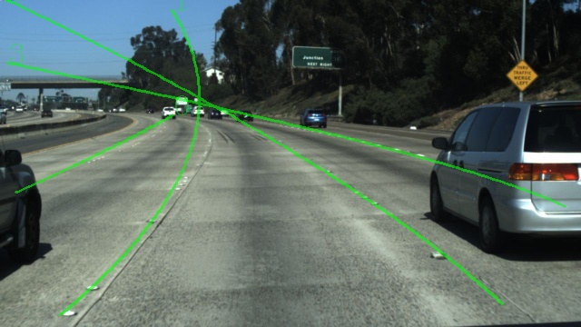

# PolyLaneNet: Lane Estimation via Deep Polynomial Regression

### input
Images with the same aspect ratio as 360×640. This model detect lane from inputs.
- input image    
    

### output
Images which the detected lane in input images is colored in green.
- output image    
Four green lines mean each detected lane which model predicted and numbers attached to each line mean line number.


### Usage
You have to specify input filetype and input filepath.    
- Image mode (image to image)   
You run sample script as below if your desired file is in {Path to polylanenet}/input/image/9.jpg.
```bash
$python3 polylanenet.py --ftype image --input_type image --input_name 9.jpg
```

- Video mode (image to video)   
You run sample script as below if your desired file is in {Path to polylanenet}/input/video/0530/1492626126171818168_0
```bash
$python3 polylanenet.py --ftype video --input_type image --input_name 0530/1492626126171818168_0
```

- Video mode (video to video)   
You run sample script as below if your desired file is in {Path to polylanenet}/input/video/video1.mp4
```bash
$python3 polylanenet.py --ftype video --input_type video --input_name video1.mp4
```


## Reference
- Repository    
[PolyLaneNet](https://github.com/lucastabelini/PolyLaneNet)

- Input images and videos    
Input images are part of [TuSimple](https://github.com/TuSimple/tusimple-benchmark) dataset and input videos are created by using TuSimple images.

## Framework

PyTorch 1.9.0


## Model Format

ONNX opset = 11

## Netron

[polylanenet.onnx.prototxt](https://netron.app/?url=https://storage.googleapis.com/ailia-models/polylanenet/polylanenet.onnx.prototxt)
