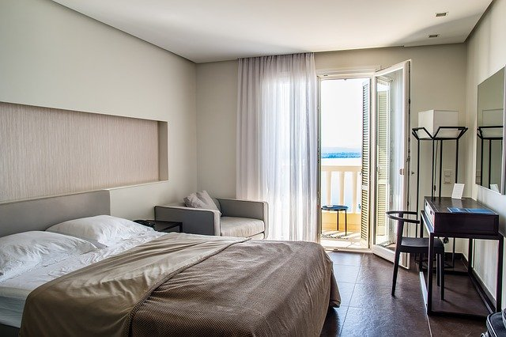
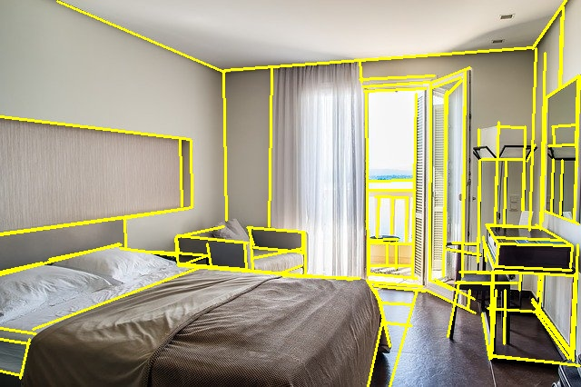

# M-LSD: Towards Light-weight and Real-time Line Segment Detection

## Input



(Image from https://www.digsdigs.com/photos/2015/05/a-bold-minimalist-living-room-with-dark-stained-wood-geometric-touches-a-sectional-sofa-and-built-in-lights-for-a-futuristic-feel.jpg)

Input shape: (1, 512, 512, 4)

## Output



## Usage

Automatically downloads the onnx and prototxt files on the first run. It is necessary to be connected to the Internet
while downloading.

For the sample image,

``` bash
$ python3 mlsd.py
```

If you want to specify the input image, put the image path after the `--input` option.  
You can use `--savepath` option to change the name of the output file to save.

```bash
$ python3 mlsd.py --input IMAGE_PATH --savepath SAVE_IMAGE_PATH
```

By adding the `--video` option, you can input the video.   
If you pass `0` as an argument to VIDEO_PATH, you can use the webcam input instead of the video file.

```bash
$ python3 mlsd.py --video VIDEO_PATH
```

## Reference

[M-LSD: Towards Light-weight and Real-time Line Segment Detection](https://github.com/navervision/mlsd)

## Framework

Tensorflow

## Model Format

ONNX opset = 11

## Netron

[M-LSD_512_large.opt.onnx.prototxt](https://netron.app/?url=https://storage.googleapis.com/ailia-models/mlsd/M-LSD_512_large.opt.onnx.prototxt)
