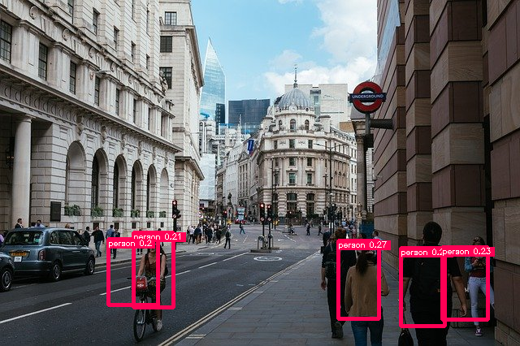

# yolov1-tiny

## Input


Shape : (1, 3, 448, 448)  
Range : [-1.0, 1.0]

## Output



- category : [0,19]
- probablity : [0.0,1.0]
- position : x, y, w, h [0,1]

### usage
Automatically downloads the onnx and prototxt files on the first run.
It is necessary to be connected to the Internet while downloading.

For the sample image,
``` bash
$ python3 yolov1-tiny.py
```

If you want to specify the input image, put the image path after the `--input` option.  
You can use `--savepath` option to change the name of the output file to save.
```bash
$ python3 yolov1-tiny.py --input IMAGE_PATH --savepath SAVE_IMAGE_PATH
```

By adding the `--video` option, you can input the video.   
If you pass `0` as an argument to VIDEO_PATH, you can use the webcam input instead of the video file.
```bash
$ python3 yolov1-tiny.py --video VIDEO_PATH
```

## Reference

- [YOLO: Real-Time Object Detection](https://pjreddie.com/darknet/yolov1/)
- [convert between pytorch, caffe prototxt/weights and darknet cfg/weights](https://github.com/marvis/pytorch-caffe-darknet-convert)

## Framework

Darknet

## Model Format

CaffeModel

## Netron

[yolov1-tiny.prototxt](https://netron.app/?url=https://storage.googleapis.com/ailia-models/yolov1-tiny/yolov1-tiny.prototxt)
