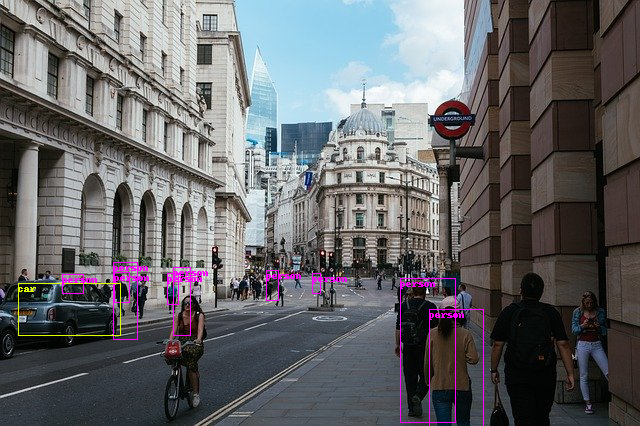

# yolov2

## Input


(Image from https://pixabay.com/ja/photos/%E3%83%AD%E3%83%B3%E3%83%89%E3%83%B3%E5%B8%82-%E9%8A%80%E8%A1%8C-%E3%83%AD%E3%83%B3%E3%83%89%E3%83%B3-4481399/)

Shape : (1, 3, 416, 416)  
Range : [-1.0, 1.0]

## Output



- category : [0,79]  
- probablity : [0.0,1.0]  
- position : x, y, w, h [0,1]  


### usage
Automatically downloads the onnx and prototxt files on the first run.
It is necessary to be connected to the Internet while downloading.

For the sample image,
``` bash
$ python3 yolov2-tiny.py
```

If you want to specify the input image, put the image path after the `--input` option.  
You can use `--savepath` option to change the name of the output file to save.
```bash
$ python3 yolov2-tiny.py --input IMAGE_PATH --savepath SAVE_IMAGE_PATH
```

By adding the `--video` option, you can input the video.   
If you pass `0` as an argument to VIDEO_PATH, you can use the webcam input instead of the video file.
```bash
$ python3 yolov2.py --video VIDEO_PATH
```

### Changing model

You can switch between models  Pascal VOC and coco dataset.

#### COCO dataset

```bash
$ python3 yolov2.py --dataset coco
```

#### Pascal VOC dataset

```bash
$ python3 yolov2.py --dataset voc
```


## Reference

- [YOLO: Real-Time Object Detection](https://pjreddie.com/darknet/yolov2/)
- [Covert original YOLO model from Pytorch to Onnx, and do inference using backend Caffe2 or Tensorflow.](https://github.com/purelyvivid/yolo2_onnx)

## Framework

Pytorch 1.3.1

## Model Format

ONNX opset=10

## Netron

[yolov2.onnx.prototxt](https://netron.app/?url=https://storage.googleapis.com/ailia-models/yolov2-tiny/yolov2-tiny-coco.onnx.prototxt)


[yolov2.onnx.prototxt](https://netron.app/?url=https://storage.googleapis.com/ailia-models/yolov2-tiny/yolov2-tiny-voc.onnx.prototxt)