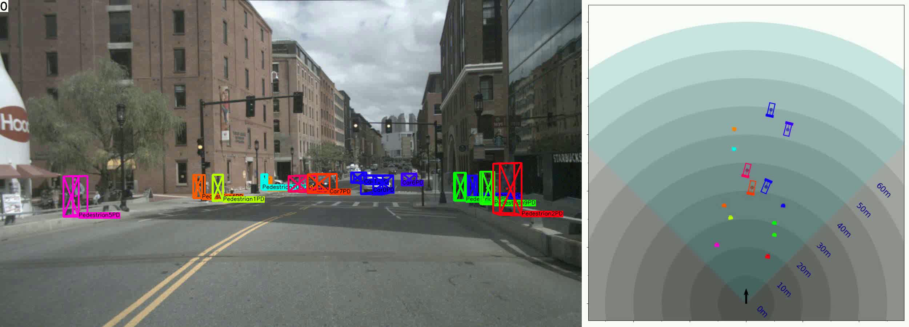
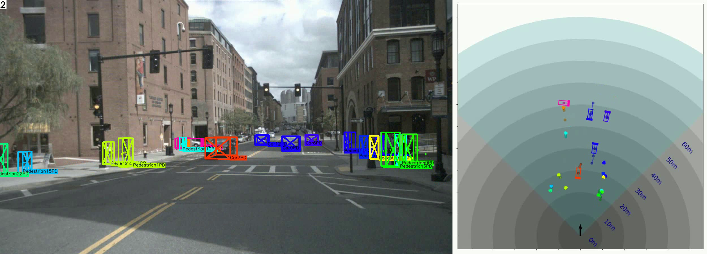
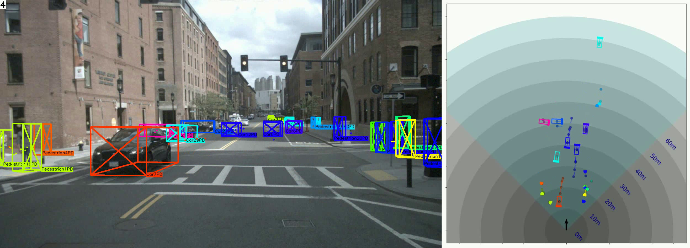

# Monocular Quasi-Dense 3D Object Tracking

## Input


(Image from https://www.nuscenes.org/download?externalData=all&mapData=all&modalities=Any)

## Output





## Requirements
This model requires additional module.

```
pip3 install numba
pip3 install pyquaternion
```

## Data Preparation

You need to download nuScenes dataset [here](https://www.nuscenes.org/download?externalData=all&mapData=all&modalities=Any).
The images used in this sample code is Mini-Set (v1.0-mini.tar, 10 scenes), which is a subset of trainval.  
Unzip, and place (or symlink) the data as below.
```
qd-3dt
├── data
  ├── nuscenes
    ├── samples
      ├── CAM_BACK
        ├── xxx.jpg
      ├── CAM_BACK_LEFT
      ├── CAM_BACK_RIGHT
      ├── CAM_FRONT
```

The "frame information file" for inference (default: data/nuscenes/anns/tracking_val_mini_v0.json) is generated using the script [here](https://github.com/SysCV/qd-3dt/tree/main/scripts).
Check [this document](https://github.com/SysCV/qd-3dt/blob/main/readme/DATA.md) for the detailed manual.

## Usage
Automatically downloads the onnx and prototxt files on the first run.
It is necessary to be connected to the Internet while downloading.

For the sample image,
```bash
$ python3 qd-3dt.py
```

The sample code outputs the following file.
- output/shows/VID_NAME/xxx.png ... 2D plot image file
- output/shows_3D/VID_tracking.mp4 ... 3D plot video file
- output/shows_BEV/VID_birdsview.mp4 ... birds view video file
- output/shows_compose/VID_compose.mp4 ... compose video file
- output/txts/VID_NAME.txt ... prediction results (text)
- output/output.json ... prediction results (coco format)

If you want to specify the "frame information file" for inference (COCO format json file), put the file path after the `--input` option.  
You can use `--savepath` option to change the name of the output directory to save.
```bash
$ python3 qd-3dt.py --input FILE_PATH --savepath SAVE_DIRE_PATH
```

You can specify the VIDEO_ID after the `--video_id` option to filter the output video.
```bash
$ python3 qd-3dt.py --video_id VIDEO_ID
```

## Reference

- [Monocular Quasi-Dense 3D Object Tracking](https://github.com/SysCV/qd-3dt)

## Framework

Pytorch

## Model Format

ONNX opset=11

## Netron

[nuScenes_3Dtracking.onnx.prototxt](https://netron.app/?url=https://storage.googleapis.com/ailia-models/qd-3dt/nuScenes_3Dtracking.onnx.prototxt)  
[nuScenes_LSTM_motion_pred.onnx.prototxt](https://netron.app/?url=https://storage.googleapis.com/ailia-models/qd-3dt/nuScenes_LSTM_motion_pred.onnx.prototxt)  
[nuScenes_LSTM_motion_refine.onnx.prototxt](https://netron.app/?url=https://storage.googleapis.com/ailia-models/qd-3dt/nuScenes_LSTM_motion_refine.onnx.prototxt)
