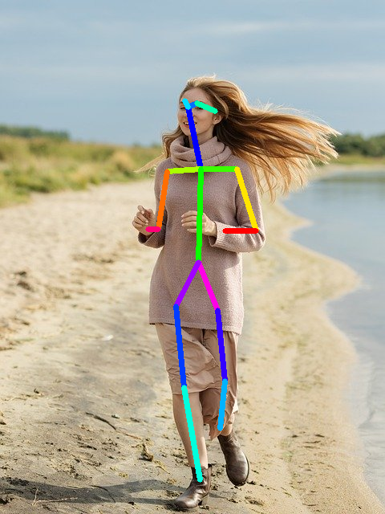

# lightweight-human-pose-estimation

## Input


Ailia input shape: (1, 3, 240, 320)  
Range: [-0.5, 0.5]

## Output



- Confidence: (1, 19, 30, 40)
- Range: [0, 1.0]

## Usage

Automatically downloads the onnx and prototxt files on the first run.
It is necessary to be connected to the Internet while downloading.

For the sample image,
``` bash
$ python3 lightweight-human-pose-estimation.py
```

If you want to specify the input image, put the image path after the `--input` option.  
You can use `--savepath` option to change the name of the output file to save.
```bash
$ python3 lightweight-human-pose-estimation.py --input IMAGE_PATH --savepath SAVE_IMAGE_PATH
```

By adding the `--video` option, you can input the video.   
If you pass `0` as an argument to VIDEO_PATH, you can use the webcam input instead of the video file.
```bash
$ python3 lightweight-human-pose-estimation.py --video VIDEO_PATH
```

The default setting is to use the optimized model and weights, but you can also switch to the normal model by using the --normal option.

## Reference

[Fast and accurate human pose estimation in PyTorch. Contains implementation of "Real-time 2D Multi-Person Pose Estimation on CPU: Lightweight OpenPose" paper.](https://github.com/Daniil-Osokin/lightweight-human-pose-estimation.pytorch)

## Framework

Pytorch 1.2.0

## Model Format

ONNX opset = 10

## Netron

[lightweight-human-pose-estimation.onnx.prototxt](https://netron.app/?url=https://storage.googleapis.com/ailia-models/lightweight-human-pose-estimation/lightweight-human-pose-estimation.onnx.prototxt)

[lightweight-human-pose-estimation.opt.onnx.prototxt](https://netron.app/?url=https://storage.googleapis.com/ailia-models/lightweight-human-pose-estimation/lightweight-human-pose-estimation.opt.onnx.prototxt)

