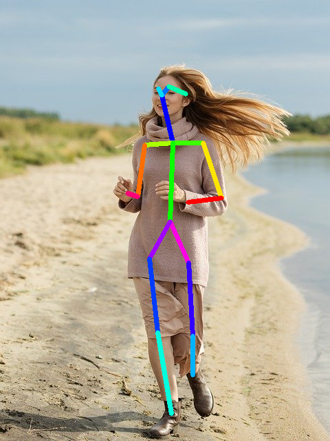

# OpenPose

## Input


Ailia input shape : (1, 3, 240, 320)  
Range : [0, 255]

## Output



- Confidence : (1, 19, 30, 40)
- Range : [0, 1.0]

## Note

OPENPOSE: MULTIPERSON KEYPOINT DETECTION
SOFTWARE LICENSE AGREEMENT
ACADEMIC OR NON-PROFIT ORGANIZATION NONCOMMERCIAL RESEARCH USE ONLY


## Usage

Automatically downloads the onnx and prototxt files on the first run.
It is necessary to be connected to the Internet while downloading.

For the sample image,
``` bash
$ python3 openpose.py
```

If you want to specify the input image, put the image path after the `--input` option.  
You can use `--savepath` option to change the name of the output file to save.
```bash
$ python3 openpose.py --input IMAGE_PATH --savepath SAVE_IMAGE_PATH
```

By adding the `--video` option, you can input the video.   
If you pass `0` as an argument to VIDEO_PATH, you can use the webcam input instead of the video file.
```bash
$ python3 openpose.py --video VIDEO_PATH
```


## Reference

[Code repo for realtime multi-person pose estimation in CVPR'17 (Oral)](https://github.com/ZheC/Realtime_Multi-Person_Pose_Estimation)

## Framework

Caffe

## Model Format

CaffeModel

## Netron

[pose_deploy.prototxt](https://netron.app/?url=https://storage.googleapis.com/ailia-models/openpose/pose_deploy.prototxt)

