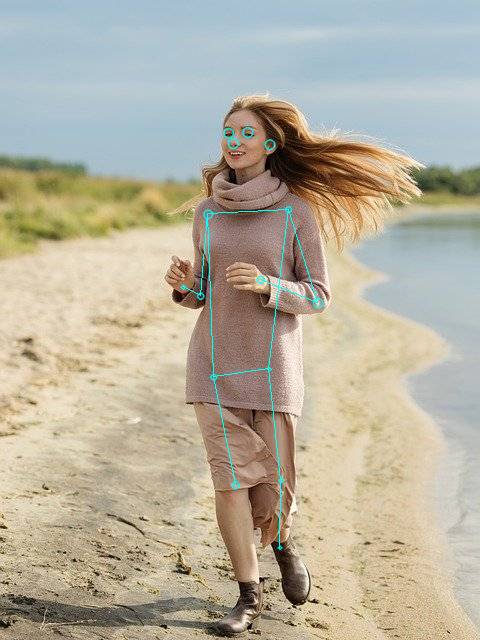

# Posenet

## Input


(Image from https://pixabay.com/ja/photos/%E5%A5%B3%E3%81%AE%E5%AD%90-%E7%BE%8E%E3%81%97%E3%81%84-%E8%8B%A5%E3%81%84-%E3%83%9B%E3%83%AF%E3%82%A4%E3%83%88-5204299/)

Input shape : (1, 3, 240, 320)  
Range : [0, 255]

## Output




## Usage

Automatically downloads the onnx and prototxt files on the first run.
It is necessary to be connected to the Internet while downloading.

For the sample image,
``` bash
$ python3 posenet.py
```

If you want to specify the input image, put the image path after the `--input` option.  
You can use `--savepath` option to change the name of the output file to save.
```bash
$ python3 posenet.py --input IMAGE_PATH --savepath SAVE_IMAGE_PATH
```

By adding the `--video` option, you can input the video.
If you pass `0` as an argument to VIDEO_PATH, you can use the webcam input instead of the video file.
```bash
$ python3 posenet.py --video VIDEO_PATH
```

Also you can set detection threshold by adding the `--threshold` option.
Default value is 0.3.

```bash
$ python3 posenet.py --threshold 0.2
```

You can select a pretrained model by specifying -a mb1-ssd or -a mb2-ssd-lite(default).

## Reference

[PoseNet Pytorch](https://github.com/rwightman/posenet-pytorch)

## Framework

Pytorch 1.13

## Model Format

ONNX opset=14

## Netron

[posenet_50.prototxt](https://netron.app/?url=https://storage.googleapis.com/ailia-models/posenet/posenet_50.onnx.prototxt)

[posenet_75.prototxt](https://netron.app/?url=https://storage.googleapis.com/ailia-models/posenet/posenet_75.onnx.prototxt)

[posenet_100.prototxt](https://netron.app/?url=https://storage.googleapis.com/ailia-models/posenet/posenet_100.onnx.prototxt)

[posenet_101.prototxt](https://netron.app/?url=https://storage.googleapis.com/ailia-models/posenet/posenet_101.onnx.prototxt)