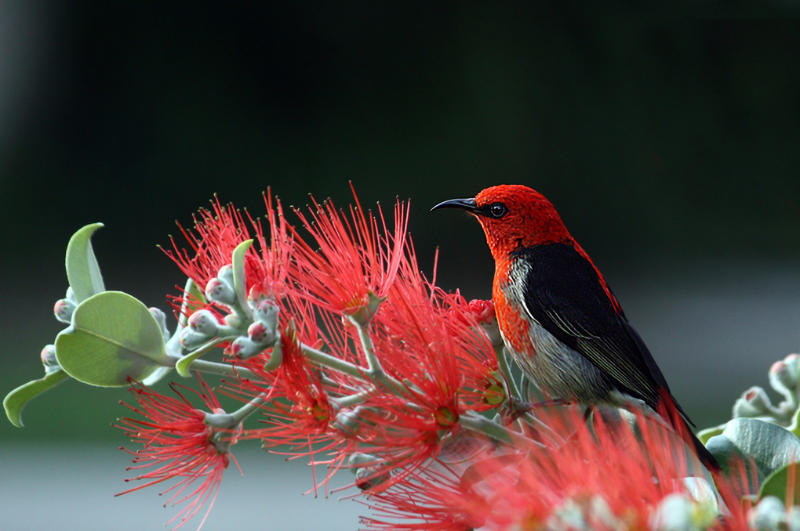

# EDSR

## Input


Ailia input shape : (1, 3, IMAGE_HEIGHT, IMAGE_WIDTH)  

## Output



Ailia output shape : (1, 3, IMAGE_HEIGHT, IMAGE_WIDTH)

## Usage
Automatically downloads the onnx and prototxt files on the first run.
It is necessary to be connected to the Internet while downloading.

For the sample image,
``` bash
$ python3 edsr.py
```

If you want to specify the input image, put the image path after the `--input` option.  
You can use `--savepath` option to change the name of the output file to save.
```bash
$ python3 edsr.py --input IMAGE_PATH --savepath SAVE_IMAGE_PATH
```

By adding the `--video` option, you can input the video.   
If you pass `0` as an argument to VIDEO_PATH, you can use the webcam input instead of the video file.
```bash
$ python3 edsr.py --video VIDEO_PATH
```

## Reference

[Enhanced Deep Residual Networks for Single Image Super-Resolution](https://github.com/sanghyun-son/EDSR-PyTorch.git)

## Framework

Pytorch 1.2.0

## Model Format

ONNX opset = 11

## Netron

[edsr.onnx.prototxt](https://netron.app/?url=https://storage.googleapis.com/ailia-models/edsr/edsr.onnx.prototxt)
